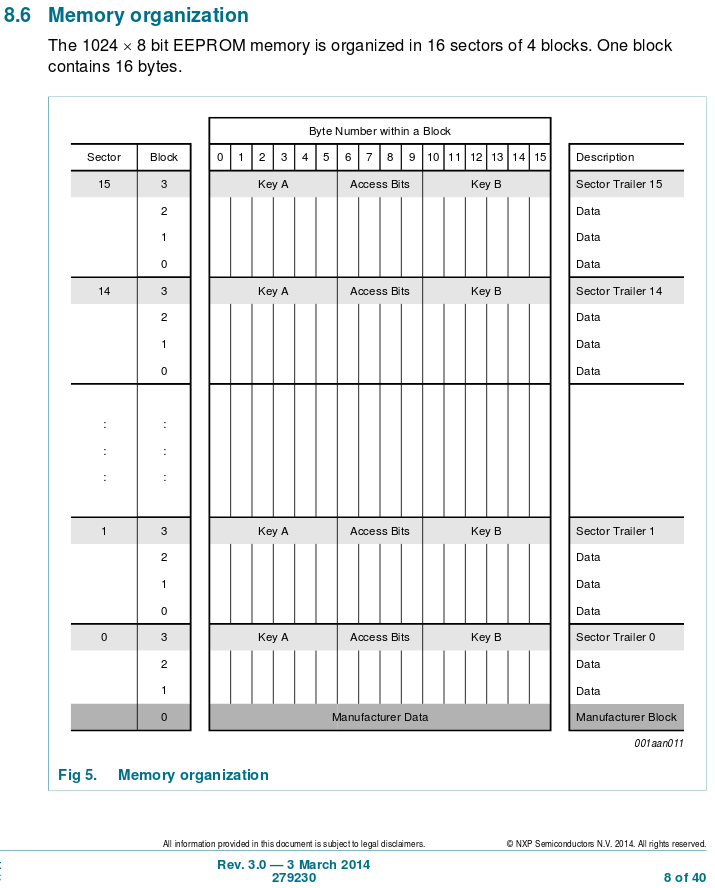
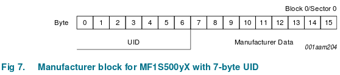

# Summary

Once a space reaches a membership of more than around ten people, it
becomes impractical to maintain access via keys and duplication. The cost
is prohibitive and the security it provides decreases with each and every
duplicate set you have cut.

Access control enables your members to gain access to your space without
the need for a set of keys and enables revocation of expired members
access without the need to get keys back from that member.

Don't get carried away with your security concerns on the electronics and
network side when considering physical access control.

Locks of any kind will only protect you against honest people, most things
don't stand up well when hit with a large hammer or a determined
individual.

Core components:

* Access tokens
* Readers
* Ironmongery
* Controller

# Access Tokens

Cards or tokens for access can come in many different types of technology,
we'll cover a few here for reference.

## Magnetic stripe

Whilst mostly obsolete, magnetic track card readers are still fairly
common in many places with all UK bank cards still having this facility.

Unless you manage to obtain a low cost or free supply of readers and
cards, it's not worth investing in this technology at this point.

If you do choose this technology you will need to program your own cards
as using bank cards will reveal more information to the reader than you
want to see. Limit your card numbers to 12 digits if you hope to have
any compatibility with commercial off the shelf solutions.

Due to the contact based nature, the card and reader will wear out and
require replacement.

Despite all of this, they are still commonly found in hotels worldwide.

See also:

* https://en.wikipedia.org/wiki/Magnetic_stripe_card
* https://en.wikipedia.org/wiki/Wiegand_interface

## Contactless Tags

Contactless tags generally come in two frequencies:

* 125KHz
* 13.56MHz

See also https://en.wikipedia.org/wiki/Radio-frequency_identification

Most contactless tags are available in multiple formats such as cards,
keyfobs or even stickers.

The main difference between the two main frequency standards is that of
range and amount of data.

The 125KHz tokens are generally longer range but only transmit a serial
number.

The 13.56MHz tokens are much shorter range (typically 10cm or less) but can
perform much more complex operations including levels of encryption and
security beyond those available at the lower frequency.

## MiFare Classic / MiFare Classic EV1

MiFare is one of the defacto 13.56MHz contactless smart tag standards and
is widely adopted. You may be familiar with it in one of the following:

* Oyster card
* Contactless bank payment cards
* University library or ID cards

MiFare tags are a sector and block based storage solution with many capabilities.

* Overview - https://en.wikipedia.org/wiki/MIFARE
* NXP index - http://www.nxp.com/products/identification-and-security/mifare-ics:MC_53422?fsrch=1&sr=1&pageNum=1
* MiFare Classic - http://www.nxp.com/products/identification-and-security/mifare-ics/mifare-classic:MC_41863

When using a MiFare tag for access control, there are primarily two techniques:

1. Serial number
2. Sector data

These will be discussed in more detail.

### Tag Structure

For the purposes of this documentation we will be focusing on
1KB MiFare Classic tags but they are also available in 4KB.

Tags are organised into 16 sectors of 4 x 16 byte blocks, see Fig 5. from the spec:



Of these 4 blocks per sector, 3 can contain data and 1 contains the sector trailer. Sector 0, the first sector on the tag is special in that it can only contain 2 blocks of data with the first reserved for the manufacturer data.

Examining the manufacturer data we see:



### Serial number

The Unique ID or tag serial number on MiFare Classic tags is 7 bytes of data. This is usually encountered as a 14 digit hexidecimal number that looks something like this:

 > AE B3 D6 E5 ED DD 6D

This 7 byte Unique ID is programmed at manufacture time and is used to identify the tag to the reader in order for operations to be performed against it. Mainly this number exists to provide an anti collision and selection mechanism when reading one tag amongst many presented to a reader.

Newer MiFare Classic EV1 tags can be programmed to return a 4 byte Non-Unique ID which can even be random instead of the usual 7 bit Unique ID. It's noted in the product data sheet that if you're programming your own tags you should set this option specifically to prevent it from being maliciously changed (you're looking for UIDFn or Unique ID Fuctionality number).

We're assuming that you are implementing UIDF0:

> UIDF0: anti-collision and selection with the double size UID according to ISO/IEC 14443-3

Other options will probably not provide you with a consistent Unique ID that you'll be happy to use for access control.

Whilst widely used for access control, the Unique ID is easily cloned and not a massively secure mechanism for controlling access. On the other hand, you may wish to use this to your advantage by allowing members to clone their tag and gain access with an NFC application on their phone.

Pros:

* Easily cloned to mobile phone for access
* Simple to implement
* Most if not all readers stating MiFare support will work
* Use a members existing tag as access token (Oyster, Bank card or whatever)

Cons:

* Easily read and cloned with basic technology
* Susceptible to replay attacks
* Security through obscurity

As previously mentioned, there are easier ways to gain access than by obtaining a tag in order to clone it to gain access. Balance your paranoia with a practicality and decide for yourself if you consider this to be an acceptable risk.

### Sector Data

Sector 0 access is authenticated however it's standard for this to be accessed using one of the default public keys. Regardless of this the Unique ID is always readable because it's primary use is as a selector when multiple tags are presented to the reader.

As has been mentioned, each sector of the tag has 3 x blocks of storage (with the exception of sector 0 which only has 2) so it's possible to put our own uniquely generated identifier into one of these blocks which we then have to authenticate against in order to retrieve.

The simple approach is to choose a tag sector and write our data to one of the blocks, then change the keys on that block in order to prevent unauthorised access or modification. Now in order to identify our member, we read the block of data from our reserved sector.

The authentication and encryption mechanisms that make this work were proved to be insecure and at Chaos Communications Congress in December 2007 (24C3) Karsten Nohl and Henryk Plötz gave a talk about this:

https://events.ccc.de/congress/2007/Fahrplan/events/2378.en.html

Phillips NXP subsequently withdrew the vanilla MiFare Classic tag replacing it with the MiFare Classic EV1 and MiFare Plus tags which addressed the security issues identified at the time. Whilst MiFare Classic EV1 is a drop in replacement with no changes required to existing infrastructure, MiFare Plus is a new standard requiring changes to support. Subsequently a side channel attack has been identified to exploit the MiFare Classic EV1 and DESFire EV cards which is less practical and potentially costly to reproduce.

See also https://en.wikipedia.org/wiki/MIFARE#Security_of_MIFARE_Classic.2C_MIFARE_DESFire_and_MIFARE_Ultralight

Both the MiFare Classic and MiFare Classic EV1 cards use 48 bit keys for sector authentication so even without an exploit it's possible to brute force the key(s) given enough time.

Pros:

* Marginally more secure than using just the tag Unique ID
* Provides entertaining challenge for members
* We determine the number rather than having to use the manufacturer Unique ID

Cons:

* More complexity to deal with
* Not massively more secure than Unique ID
* Requires reader support
* Can't re-use an existing tag (like Oyster or bank) as we need to modify it

Whilst using sector data provides marginally more security, realistically there is probably few benefits to utilising it above Unique ID. both are clonable with more or less effort so it depends how much obscurity you wish to provide in your security. A sledge hammer is still a more likely means of attack than a card clone.

## MiFare Application Directory

If we are to use sector data, it's wise to consider if you may want to use more than one sector of your tag for other applications. If this is the case, then MiFare Application Directory is worth investigating.

Instead of going directly to your programmed sector, we use the application directory to look up our application ID and then that determines which sector your data is held in.

There is substantially more work to support this model, however it enables a multi-use card that could potentially be shared with other organisations or groups. It is unlikely that it is worth the additional effort required to support this but it is included here for interest.

See also http://www.nxp.com/documents/application_note/AN10787.pdf

## Other technologies

The following technologies are also available but were not discussed:

* Contact based smart cards
* Barcode or QR code

Generally these would not be considered suitable for controlling access.

# Readers

## General recommendations


## Recommended Readers

### Seeed Studio RDM880

* https://www.seeedstudio.com/13.56Mhz-RFID-module-IOS(IEC)-14443-type-a-p-196.html

Supports unique ID or sector data. Available from Cool Components in the UK:

* https://www.coolcomponents.co.uk/rfid-reader-writer-13-56mhz.html

### NXP PN532

Available with a breakout board from Adafruit:

* https://www.adafruit.com/products/364

Also available from ebay in various forms if you search for PN532.

# Ironmongery

There are as many locking options as there are types of door for them to
installed upon, so whilst it's possible to give general advice every door
and circumstance is different.

When looking at locking hardware, the first piece of information one must
consider is the mode in which they fail.

## Fail Open (FO)

Fail Open or Fail Safe locks as implied fail in a manner that leaves the
door insecure. This type of lock should not be used on an external door
unless suitable battery backup is provided to retain security in the event
of a power outage.

The lock is released by interrupting power supplied to the lock. A Break
Glass Unit must be installed to permit the door to open regardless of the
status of the controller. It is adviseable to monitor actuation of the
Break Glass Unit to prevent it being activated and the door being left in
an insecure state for an unknown period of time.

Consideration should also be given to if the door should open on sounding
of a fire alarm. Whilst it may seem obvious that doors on the path of a
fire escape route should automatically open on sounding, there are
occasions when this is not entirely clear and advice should be sought from
your local fire service. Consultation with the fire services college does
not guarantee compliance with your local fire service. If in doubt,
consult with your local fire service before performing installation work.

As an external door would likely be a fire exit, the likelihood of the
fire service requiring it to fail open when the fire alarm is sounding is
another reason to consider this an unsuitable locking mechanism for an
external door.

## Fail Secure (FS)

Fail secure locks result in the door being left in a secure, closed state.

The lock is released by applying power to the locking mechanism. This type
of lock is normally an electronic enablement to a traditional locking
mechanism such as an electronic strike plate.

Due to the way in which this is a mechanical enablement to a traditional
locking mechanism, there are fewer considerations to interconnection with
fire alarms though as with fail open locks, it is wise to consult your
local fire service should you be in any doubt of the safety requirements.

Fail secure locks are recommended.

## Recommended Locking Hardware

Whilst many locking mechanisms exist, the following come recommended
depending on the specific circumstances.

### Abloy EL560

See http://tinyurl.com/z47cumu

This lock is extremely expensive and requires installation by a suitably
skilled locksmith. It is a traditional lock in all appearances but does
not work in a traditional manner.

The handles on either side of the door operate independently with an
electronic enablement.

It can be configured to operate Fail Secure or Fail Open, it can also be
configured to operate opening inwards or outwards.

### Cisa

* 11610 - http://www.saundersonsecurity.co.uk/acatalog/Cisa_11610_Rim_Electric_Locks.html
* 1A721 - http://www.saundersonsecurity.co.uk/acatalog/Cisa_Elettrika_1A721_Elec_lock_For_Metal_1A721.html

These locks are fail secure and are released by application of 24v AC.

Whilst the Cisa locks offer a great value and level of security they are
very specifically handed and direction focused. You need to know which
direction your door opens (inwards or outwards) and if it is hinged on the
left or right. See this handy diagram:

```
  +--------+   +--------+
  | 1      |   | 2      |
  |    \   |   |   /    |
  +---  ---+   +---  ---+

  +--------+   +--------+
  | 3      |   | 4      |
  |        |   |        |
  +---  ---+   +---  ---+
       /           \
```

* 1. Right hand inward opening
* 2. Left hand inward opening
* 3. Right hand outward opening
* 4. Left hand outward opening

Make sure that you purchase the correct handing and direction when
ordering as it cannot be changed.

This is the lock of choice for London and Manchester Hackspaces.

### Effeff Electric Strike

Available in fail open or fail secure flavours and for different
voltages.

One of the main considerations when using this type of release is the lock
that it is paired with.

Suggested lock: Imperial Locks G7088

This is an oval cylinder lock and may not be suitable for your
circumstances. The main considerations should be:

Provision of an override lock should the system fail.

It should have an anti thrust bolt to prevent it being pushed back by
inserting something between the door and frame.  Distance between main
latch and anti thrust bolt should be checked to ensure that the anti
thrust component falls outside the gap created for the latch.

# Controller

## Local caching of data

# Other considerations

## DDA

* Reader, lock and break glass unit heights
* Reader location base on door handing

## Fire escape routes


## Override mechanisms

# Case Studies

## London Hackspace


## Manchester Hackspace (Hacman)


## Swindon Hackspace
